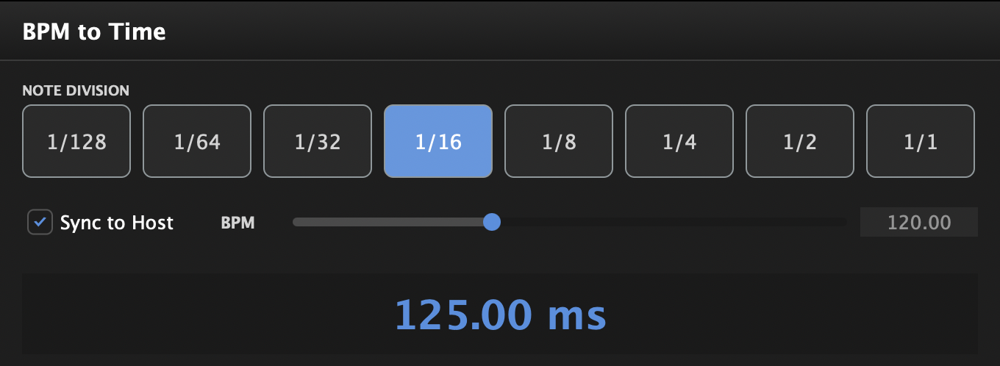

# BPM2Time

A lightweight Audio Unit plugin that converts your DAW's tempo into millisecond values for different note divisions. Perfect for quickly calculating delay times, reverb pre-delay, or any other time-based effect parameter.



## Features

- **Real-time BPM Sync**: Automatically reads tempo from your DAW
- **Manual BPM Mode**: Override with custom tempo when needed
- **8 Note Divisions**: 1/128, 1/64, 1/32, 1/16, 1/8, 1/4, 1/2, and 1/1 (whole note)
- **Instant Calculations**: See millisecond values update in real-time
- **Minimal CPU Usage**: Optimised to use virtually no resources
- **Clean Interface**: Modern, dark-themed UI that's easy to read

## Use Cases

- Calculate delay times that sync to your project tempo
- Determine reverb pre-delay values for rhythmic spacing
- Set attack/release times for tempo-synced compression
- Quick reference for any time-based effect parameter
- Useful for both mixing and sound design workflows

## Installation

### Pre-built Binary (macOS Apple Silicon)

1. Download the latest release from the [Releases page](https://github.com/tehguitarist/BPM2Time/releases)
2. Extract the `.component` file
3. Copy to `~/Library/Audio/Plug-Ins/Components/`
4. Restart your DAW

### Building from Source

#### Requirements

- macOS 11.0 or later (Apple Silicon)
- Xcode 13 or later
- [JUCE Framework](https://juce.com/) 7.0+
- Projucer (comes with JUCE)

#### Build Instructions

1. Clone the repository:
   ```bash
   git clone https://github.com/tehguitarist/BPM2Time.git
   cd BPM2Time
   ```

2. Open `BPM2Time.jucer` in Projucer

3. Click "Save and Open in IDE" to generate the Xcode project

4. In Xcode, select the **Release** scheme:
   - Click on the scheme dropdown (top toolbar)
   - Select "BPM2Time" instead of "BPM2Time-Test"

5. Build the project (⌘B)

6. The plugin will be automatically installed to:
   ```
   ~/Library/Audio/Plug-Ins/Components/BPM2Time.component
   ```

#### Build Configuration

The project is optimised for minimal binary size:
- ARM64 architecture only
- Link-time optimisation enabled
- Debug symbols stripped
- Dead code elimination
- Minimal JUCE modules

Final plugin size: ~2-3MB

## Usage

1. **Load the plugin** in your DAW (it can be loaded on any track as it passes audio through unchanged)

2. **Choose sync mode**:
   - **"Sync to Host" ON**: Reads tempo from your DAW (recommended)
   - **"Sync to Host" OFF**: Use the manual BPM slider

3. **Select a note division** by clicking one of the buttons (1/128 to 1/1)

4. **Read the millisecond value** displayed in the centre of the plugin

5. **Use the value** in your delay, reverb, or other time-based effects. Or get really creative and use it on your mixbus comp to pump in time with the music.

### Tips

- The manual BPM slider updates to show the host tempo even when sync is off, giving you a handy reference
- The plugin only checks for tempo changes when your DAW is playing, saving CPU when paused
- Use 1/4 and 1/8 notes for delay times
- Use 1/16 or 1/32 notes for short slapback delays
- Use 1/2 or 1/1 notes for reverb pre-delay

## Technical Details

- **Format**: Audio Unit (AU)
- **Architecture**: Apple Silicon (ARM64)
- **Minimum OS**: macOS 11.0
- **Audio Processing**: Zero-latency passthrough
- **BPM Detection**: Reads from DAW transport (twice per second when playing)
- **Framework**: JUCE 7.0+
- **NOTE**: Other formats easily added by editing the .jucer file and compiling with your IDE of choice, though optimisations are somewhat linked to XCode.

## Contributing

Contributions are welcome! Please feel free to submit a Pull Request. For major changes, please open an issue first to discuss what you would like to change.

### Development

- Code style: Follow existing JUCE conventions
- Keep the plugin lightweight and focused
- Test on multiple DAWs (Logic Pro, Ableton Live, etc.)
- Ensure backwards compatibility with saved sessions

## Licence

This project is licensed under the GPL-3.0 Licence - see the [LICENSE](LICENSE) file for details.

## Acknowledgements

- Built with [JUCE Framework](https://juce.com/)
- Inspired by the need for quick tempo calculations during mixing sessions

## Support

If you encounter any issues or have feature requests, please [open an issue](https://github.com/tehguitarist/BPM2Time/issues) on GitHub.

## Changelog

### Version 1.0.0 (2024)
- Initial release
- 8 note divisions (1/128 to 1/1)
- Host tempo sync and manual BPM mode
- Optimised for Apple Silicon

---

**Made with ❤️ for producers and mix engineers**