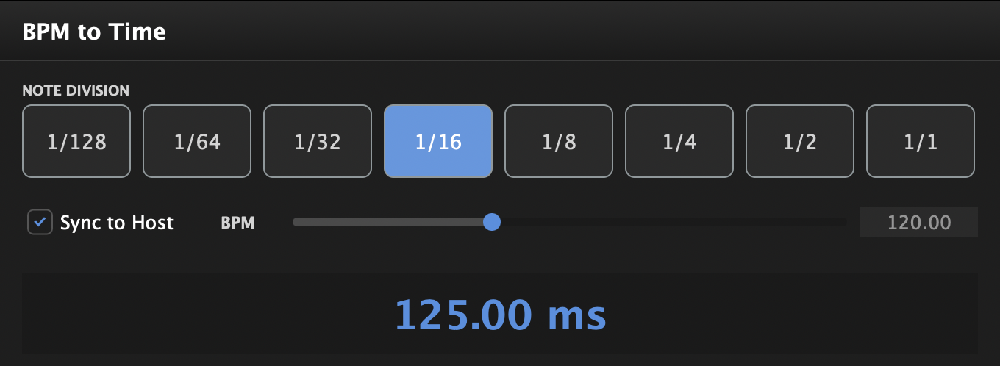

# BPM2Time

[](https://github.com/tehguitarist/BPM2Tme/actions/workflows/ci.yml)

A lightweight Audio Unit / VST3 plugin that converts your DAW's tempo into millisecond values for different note divisions. Perfect for quickly calculating delay times, reverb pre-delay, or any other time-based effect parameter.



## Features

- **Real-time BPM Sync**: Automatically reads tempo from your DAW
- **Manual BPM Mode**: Override with custom tempo when needed
- **8 Note Divisions**: 1/128, 1/64, 1/32, 1/16, 1/8, 1/4, 1/2, and 1/1 (whole note)
- **Instant Calculations**: See millisecond values update in real-time
- **Minimal CPU Usage**: Optimised to use virtually no resources
- **Clean Interface**: Modern, dark-themed UI that's easy to read

## Use Cases

- Calculate delay times that sync to your project tempo
- Determine reverb pre-delay values for rhythmic spacing
- Set attack/release times for tempo-synced compression
- Quick reference for any time-based effect parameter
- Useful for both mixing and sound design workflows

## Installation

### Pre-built Binary

Download the latest release from the [Releases page](https://github.com/tehguitarist/BPM2Tme/releases). Each release includes, per platform:

- **macOS**: a signed & notarized `.pkg` installer (choose AU, VST3, or both) and a raw `.zip` of the bundles. AU is Apple Silicon only.
- **Windows**: a VST3 `.exe` installer and a raw `.zip`.
- **Linux**: a VST3 `.deb` and a raw `.zip`.

To install manually from the zip instead of the installer:
- **macOS**: extract and copy `BPM2Time.component` to `~/Library/Audio/Plug-Ins/Components/`, or `BPM2Time.vst3` to `~/Library/Audio/Plug-Ins/VST3/`.
- **Windows**: extract `BPM2Time.vst3` to `C:\Program Files\Common Files\VST3\`.
- **Linux**: extract `BPM2Time.vst3` to `~/.vst3/` or `/usr/lib/vst3/`.

Restart your DAW after installing.

### Building from Source

#### Requirements

- [CMake](https://cmake.org/) 3.15+
- A C++17 toolchain (Xcode command line tools on macOS, MSVC on Windows, GCC/Clang on Linux)
- Git (for the JUCE submodule)

#### Build Instructions

```bash
git clone --recurse-submodules https://github.com/tehguitarist/BPM2Tme.git
cd BPM2Tme
cmake -B build -DCMAKE_BUILD_TYPE=Release
cmake --build build --config Release --target BPM2Time_AU      # macOS AU
cmake --build build --config Release --target BPM2Time_VST3    # VST3, all platforms
```

If you already cloned without `--recurse-submodules`, run `git submodule update --init --recursive` first.

`COPY_PLUGIN_AFTER_BUILD` is enabled, so a successful build installs directly to your user plugin
folders (`~/Library/Audio/Plug-Ins/Components` and `.../VST3` on macOS). Bump the `VERSION` in
`CMakeLists.txt` if Logic doesn't pick up a rebuilt AU — it caches AU components by version.

#### Build Configuration

- macOS builds are Apple Silicon (arm64) only, minimum macOS 11.0
- AU format is macOS-only; VST3 builds on macOS, Windows, and Linux
- See [`.claude/rules/build.md`](.claude/rules/build.md) for the full CI/release pipeline (GitHub Actions), signing/notarization, and installer details

## Usage

1. **Load the plugin** in your DAW (it can be loaded on any track as it passes audio through unchanged)

2. **Choose sync mode**:
   - **"Sync to Host" ON**: Reads tempo from your DAW (recommended)
   - **"Sync to Host" OFF**: Use the manual BPM slider

3. **Select a note division** by clicking one of the buttons (1/128 to 1/1)

4. **Read the millisecond value** displayed in the centre of the plugin

5. **Use the value** in your delay, reverb, or other time-based effects. Or get really creative and use it on your mixbus comp to pump in time with the music.

### Tips

- The manual BPM slider updates to show the host tempo even when sync is off, giving you a handy reference
- The plugin only checks for tempo changes when your DAW is playing, saving CPU when paused
- Use 1/4 and 1/8 notes for delay times
- Use 1/16 or 1/32 notes for short slapback delays
- Use 1/2 or 1/1 notes for reverb pre-delay

## Technical Details

- **Formats**: Audio Unit (AU, macOS only) and VST3 (macOS, Windows, Linux)
- **macOS Architecture**: Apple Silicon (ARM64)
- **Minimum OS**: macOS 11.0
- **Audio Processing**: Zero-latency passthrough
- **BPM Detection**: Reads from DAW transport (twice per second when playing)
- **Framework**: JUCE 8.0.14 (via CMake, see [`.claude/rules/build.md`](.claude/rules/build.md))

## Contributing

Contributions are welcome! Please feel free to submit a Pull Request. For major changes, please open an issue first to discuss what you would like to change.

### Development

- Code style: Follow existing JUCE conventions
- Keep the plugin lightweight and focused
- Test on multiple DAWs (Logic Pro, Ableton Live, etc.)
- Ensure backwards compatibility with saved sessions

## Licence

This project is licensed under the GPL-3.0 Licence - see the [LICENSE](LICENSE) file for details.

## Acknowledgements

- Built with [JUCE Framework](https://juce.com/)
- Inspired by the need for quick tempo calculations during mixing sessions

## Support

If you encounter any issues or have feature requests, please [open an issue](https://github.com/tehguitarist/BPM2Tme/issues) on GitHub.

## Changelog

### Version 1.1.0
- Fixed font deprecation warnings
- UI Now respects Sync option correctly

### Version 1.0.0
- Initial release
- 8 note divisions (1/128 to 1/1)
- Host tempo sync and manual BPM mode
- Optimised for Apple Silicon

---

**Made with ❤️ for producers and mix engineers**
